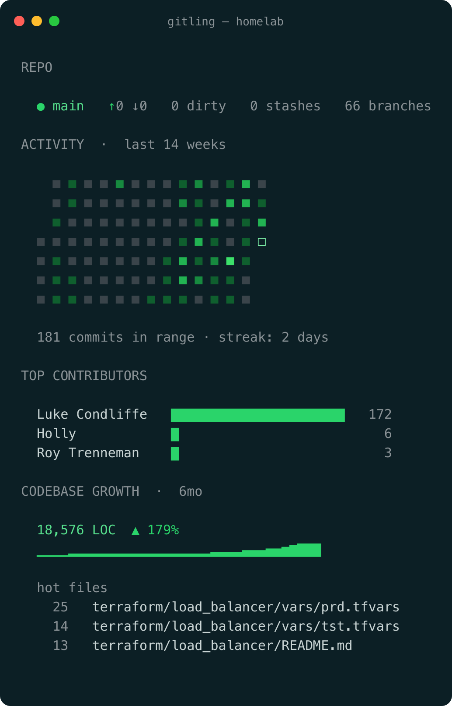

# gitling

[](https://github.com/lcondliffe/gitling/actions/workflows/ci.yml)

A terminal-native, at-a-glance summary of a git repository: recent activity,
top contributors, and codebase growth. Run it once at the start of a session to
orient yourself — it's not a replacement for `git log` or a full TUI.



## Install

With Homebrew:

```sh
brew install lcondliffe/tap/gitling
```

Or with Go:

```
go install github.com/lcondliffe/gitling/cmd/gitling@latest
```

`go install` writes the binary to `$GOBIN`, or to `$(go env GOPATH)/bin` when
`GOBIN` is unset. Make sure that directory is on your `PATH`:

```
export PATH="$(go env GOPATH)/bin:$PATH"
```

For zsh, add that line to `~/.zshrc` so `gitling` is available in new
terminals too.

Or grab a prebuilt binary for your platform from the
[latest release](https://github.com/lcondliffe/gitling/releases/latest) and put
it on your `PATH`.

## Output

Four panels, single screen:

1. **Repo vitals** — branch, ahead/behind upstream, dirty files, stashes, branches.
2. **Activity heatmap** — GitHub-style contribution grid (default last 14 weeks),
   5-step intensity, today's cell marked with a hollow square. Total commits and
   current streak below.
3. **Top contributors** — up to 5 authors by commit count in range, with bars.
4. **Codebase growth** — total LOC, 6-month percent change, a trend sparkline,
   and the hottest files by churn.

## Usage

```
gitling                  # default dashboard (last 14 weeks)
gitling --since 30d      # override the range for all sections (d, w, mo, y)
gitling graph --since 1y # focused activity drill-down
gitling --graph --bucket week --since 1y
gitling churn --since 1y # file churn: all files, ranked by commit count
gitling contributors     # all authors, ranked (--since sets the window)
gitling branches         # branch overview: ahead/behind, last commit, author
gitling --json           # structured dashboard data for scripts/integrations
gitling --no-color       # plain output, no ANSI escape codes
gitling --color=always   # force color even when stdout isn't a terminal
gitling --config ~/gitling.json  # use an explicit config file
```

### Color

`--color` takes `always`, `never`, or `auto` (the default). `auto` honors the
[`NO_COLOR`](https://no-color.org/) convention and auto-disables color when
stdout isn't a terminal; `always` forces color on even when piping into a
pager or a screenshot/SVG renderer; `never` forces it off. `--no-color` is
kept as a back-compat alias for `--color=never` and always wins if both are
given.

### Config file

gitling optionally reads defaults from a JSON config file at
`$XDG_CONFIG_HOME/gitling/config.json`, falling back to
`~/.config/gitling/config.json` when `XDG_CONFIG_HOME` is unset. Override the
path with `--config <path>` or the `GITLING_CONFIG` environment variable. The
file is entirely optional — a missing file is not an error, but a malformed
one is reported to stderr.

Supported keys, all optional:

```json
{
  "since": "30d",
  "color": "auto",
  "bucket": "week"
}
```

Precedence: command-line flags always override the config file, which
overrides gitling's built-in defaults. Panel toggles aren't yet
config-driven; that's left as future work.

## How it works

- **gitdata** shells out to `git log --numstat` and a handful of cheap
  plumbing commands. Author date is used for bucketing.
- **aggregate** rolls commits up into per-day buckets (counts, line deltas,
  per-author and per-file tallies). Range queries sum the days in range, so
  changing `--since` never invalidates the cache.
- **cache** persists the rollup as a gob file under `.git/gitling-cache/`,
  keyed by the last HEAD seen. Each run only walks commits newer than the last,
  making repeat runs effectively instant.
- **render** draws everything with 256-color ANSI chosen to read on both light
  and dark backgrounds, or emits the same model as indented JSON when `--json`
  is set.

The layers are cleanly separated: the git backend (currently shell-out, a
go-git backend could replace it) and the cache (gob, could become sqlite) are
each swappable without touching the others.

## Build

```
go build ./cmd/gitling
```

Pure Go standard library — no external dependencies.

## Releases

Tagging a commit `vX.Y.Z` triggers the release workflow, which cross-compiles
binaries (linux/darwin/windows, amd64/arm64), attaches them with a
`checksums.txt`, and publishes a GitHub Release with auto-generated notes:

```
git tag v0.1.0
git push origin v0.1.0
```

## Status

v0.2. The drill-down subcommands have landed — each available as a
subcommand or the matching `--flag` (naming two different views errors):

- `graph` — focused activity view with day/week/month buckets.
- `churn` — every file touched in range, ranked by commit count.
- `contributors` — all authors ranked (beyond the dashboard's top 5).
- `branches` — per-branch ahead/behind vs upstream (or the default branch),
  last-commit age, and tip author.
