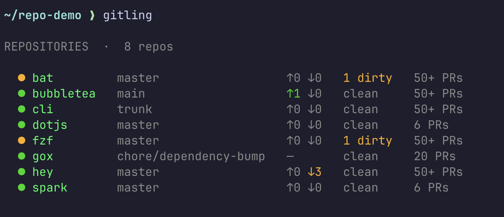

# gitling

[](https://github.com/lcondliffe/gitling/actions/workflows/ci.yml)

A terminal-native, at-a-glance summary of a git repository: recent activity,
top contributors, and codebase growth. Run it once at the start of a session to
orient yourself — it's not a replacement for `git log` or a full TUI.


Six panels on one screen. They lay out in two columns on a terminal at least
100 columns wide and stack into one below that; `--layout wide|stack` forces
either shape.

`--layout compact` (or `"layout": "compact"` in config) prioritizes current
state in short terminals and tmux panes. Auto switches to compact when the full
dashboard exceeds the detected height; explicit `wide` and `stack` always keep
their full layouts.

Compact targets at most 24 rows, or the terminal height if smaller, including
the surrounding blank lines. Panels use the full width:

- Repo state is mandatory: its minimum is two borders plus **all** wrapped
  state lines, including conflicts, interrupted operations, staged/modified
  work, upstream divergence, stash and branch-health warnings. Long branch
  names wrap rather than displacing warnings.
- Optional panels are admitted in order: open PRs, activity summary, recent
  commits, contributors, net-line history, hot files. Each needs two borders
  plus its complete body; the activity chart becomes an explicitly labelled
  summary. Once a panel cannot fit, it and the lower-priority panels are named
  in an `omitted:` footer. Existing title/path ellipses still mark width cuts.
- If even state plus the omission footer cannot fit, output deliberately
  exceeds the height and says so. Scroll rather than lose a blocker. Use
  `--layout stack` for full details; this is still one-shot output, not a TUI.

Rows are detected with an ioctl on Linux/macOS/BSD or the visible console
window on Windows. A positive `LINES` overrides rows **only on a real
terminal**. Unknown rows disable automatic compaction; pipes never inherit a
height limit. Explicit compact has a stable 24-row target and an 80-column
fallback when width is unknown. The existing `COLUMNS` width override remains
available, including in pipes. JSON is unaffected by layout or dimensions.

## Install

```sh
brew install lcondliffe/tap/gitling
```

Or with Go:

```sh
go install github.com/lcondliffe/gitling/cmd/gitling@latest
```

That writes to `$GOBIN`, or `$(go env GOPATH)/bin` when `GOBIN` is unset — make
sure it's on your `PATH`. Prebuilt binaries are on the
[latest release](https://github.com/lcondliffe/gitling/releases/latest).

## Usage

```sh
gitling                  # default dashboard (last 14 weeks)
gitling --since 30d      # activity, contributors and churn window (d, w, mo, y)
gitling graph --since 1y # focused activity drill-down
gitling churn --since 1y # file churn: all files, ranked by commit count
gitling contributors     # all authors, ranked (--since sets the window)
gitling branches         # branch overview: ahead/behind, last commit, author
gitling tidy             # dry run: local branches that are safe to delete
gitling tidy --apply     # actually delete them (prompts once)
gitling --recent 10      # list the last 10 commits (0 hides the panel)
gitling --layout stack   # force one column; --layout wide forces two
gitling --layout compact # prioritize current state in short panes
gitling --prs=false      # skip the open pull requests panel
gitling --json           # structured dashboard data for scripts/integrations
gitling --date commit    # bucket by commit date instead of author date
gitling --color=always   # always, never, or auto (default; honors NO_COLOR)
gitling --config ~/gitling.json  # use an explicit config file
gitling                  # in a directory of repos: one-line-per-repo overview
gitling --fetch          # ...fetching each repo first for fresh ahead/behind
```

Each drill-down is available as a subcommand or the matching `--flag`; naming
two different views is an error.

### Dates, scales and history scope

`--since` selects inclusive local calendar days for activity, contributors and
file churn, from today minus the duration through today. `mo` means 30 days and
`y` means 365 days here. These metrics cover non-merge commits reachable from
HEAD, using author dates by default (`--date commit` selects committer dates).
They do not count every branch. Recent commits ignore `--since`, include merges
and use committer dates. Repo/branch state, open PRs, the multi-repo overview
and `tidy` are live-state views, not filtered history.

The heatmap prints the requested date interval, with year context, and a
compact intensity ramp (zero through the requested interval's daily peak;
nonzero levels are quartiles of that peak, not percentiles). `□` marks today;
rows run Sunday through Saturday. Narrow displays retain the newest weeks and
explicitly report the visible interval/count separately from requested totals
and streak, with an older-weeks omission marker. Long graph series sum adjacent
day/week/month buckets into width-bounded display bars; the scale is commits
per **display bar**, and the whole requested interval is retained. The counts
below remain the original nonzero calendar buckets; first/last buckets may be
partial because the requested window cuts through them.

Net-line history is **approximate historical net-line change**, not a count of
lines currently in the checkout. It cumulatively sums insertions minus deletions
from available HEAD non-merge history (negative cumulative samples clamp to
zero). Binary changes and merge-resolution changes are not represented; copied,
reverted or parallel changes can make this diverge from current LOC. Its chart
always samples the last **six calendar months**, independently of `--since`,
using `--date`'s basis. The chart labels its date window and min/max scale;
percentage compares the cumulative total with the six-month baseline, when
available. Narrow growth charts retain bucket endpoints, not sums of cumulative
samples. Shallow clones get an explicit incomplete-history caveat. The existing
JSON `growth.total_loc` field retains its compatibility name and the same
approximate semantics.

## Open PRs

The dashboard shows a panel of open pull requests when it can get them, and
hides it entirely when it can't or when there are none. It never talks to a
forge API itself: it shells out to the platform's own CLI, so authentication is
whatever that CLI already has. Today that means GitHub via
[`gh`](https://cli.github.com); other platforms (GitLab's `glab`, Azure DevOps'
`az repos`) are one entry in `internal/forge`. With no CLI installed, no
network, or a remote gitling doesn't recognise, the panel just doesn't appear —
`--prs=false` skips the lookup altogether.

## Many repos



Run `gitling` in a directory that isn't a repo but whose immediate
subdirectories are (a `~/repo/*` layout) and it renders a one-line-per-repo
overview instead of an error: current branch, ahead/behind upstream,
working-tree state, and the open PR count. Ahead/behind comes from the local
tracking refs — instant, but only as fresh as each repo's last fetch;
`--fetch` fetches every repo first (failures fall back to local refs). PR
counts follow the same rules as the dashboard panel and are skipped with
`--prs=false`. Only immediate children are scanned, and nothing is written.

## Tidy

`gitling tidy` is the one subcommand that changes anything. It finds the local
branches you're done with and, on request, deletes them:

```sh
gitling tidy                  # dry run over merged + upstream-gone branches
gitling tidy --apply          # delete them, prompting once first
gitling tidy --merged         # narrow to branches merged into the default branch
gitling tidy --gone           # narrow to branches whose upstream was deleted
gitling tidy --stale          # also include branches untouched for 90 days
gitling tidy --stale 180d     # ...with a different threshold
gitling tidy --protect 'release/*'   # never delete matching branches
gitling tidy --apply --yes    # no prompt, for when you already know
gitling tidy --no-fetch       # skip the pruning fetch
```

```text
TIDY  ·  4 of 9 branches

  merged into origin/main   -d
    chore/tidy-readme   14d ago    a1b2c3d

  upstream gone (squash-merged)   -D
    feat/heatmap        1mo ago    9f8e7d6
    fix/parse-numstat   3mo ago    4c5b6a7

  4 branches to delete, 3 needing -D
  dry run — pass --apply to delete
```

### What it selects, and how much it trusts each category

Which group a branch lands in decides how it gets deleted:

- **merged** — the tip is an ancestor of the default branch, so the work is
  provably in. Deleted with `git branch -d`, leaving git's own merge check as a
  second safety net under gitling's.
- **gone** — the branch tracked a remote branch that no longer exists: the shape
  a squash-merged pull request leaves behind. The commits landed under new
  hashes, so git sees the branch as unmerged and only `-D` will drop it. The
  forge deleting the remote branch is evidence it's safe, but circumstantial
  rather than proof — which is why the plan marks these `-D` rather than hiding
  the distinction.
- **stale** — old, and neither merged nor gone. The only category where deleting
  can lose work, so it's never selected unless you ask with `--stale`.

`--merged` and `--gone` narrow the selection to what they name. `--stale` only
ever adds: asking to also clean up the old ones shouldn't quietly stop cleaning
up the safe ones.

"Merged" is measured against the *remote* default branch, so a branch merged
into your local `main` but never pushed is treated as unmerged and needs `-D`.

### Safety

- **Dry run by default.** Nothing is deleted without `--apply`, which prompts
  once (unless `--yes`) with the full plan on screen. Anything that isn't an
  explicit `y` — a bare newline, no stdin at all — is a no.
- **The current and default branches are never deleted**, nor anything matching
  a `--protect` glob or the config file's `protect` list. `--protect` adds to
  that list rather than replacing it.
- **Every branch shows the commit it pointed at**, before and after deletion, so
  anything can be restored with `git branch <name> <hash>`.
- **It fetches with `--prune` first** (skip with `--no-fetch`), because
  "upstream gone" is meaningless against stale remote-tracking refs. A failed
  fetch warns and continues — being offline shouldn't stop you tidying merged
  branches — but it says so, because the plan is then built on older
  information.
- A branch git refuses to delete is reported and the rest still run.

## Config file

gitling optionally reads defaults from
`$XDG_CONFIG_HOME/gitling/config.json`, falling back to
`~/.config/gitling/config.json`. Override with `--config <path>` or
`GITLING_CONFIG`. A missing file is fine; a malformed one is reported to
stderr.

```json
{
  "since": "30d",
  "color": "auto",
  "bucket": "week",
  "recent": 5,
  "layout": "auto",
  "prs": true,
  "protect": ["release/*", "wip/keep-me"]
}
```

Command-line flags override the config file, which overrides the built-in
defaults. `protect` is the exception: `--protect` adds to the configured list
rather than replacing it, since a config saying "never delete `release/*`"
shouldn't be switched off by naming one more pattern.

## Build

```sh
go build ./cmd/gitling
```

Pure Go standard library: `go.mod` has no requirements and there is no
`go.sum`. Needs `git` on `PATH` at runtime.
