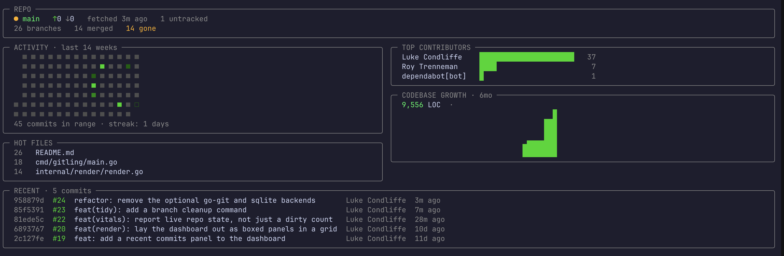

# gitling

[](https://github.com/lcondliffe/gitling/actions/workflows/ci.yml)

A terminal-native, at-a-glance summary of a git repository: recent activity,
top contributors, and codebase growth. Run it once at the start of a session to
orient yourself — it's not a replacement for `git log` or a full TUI.



## Install

With Homebrew:

```sh
brew install lcondliffe/tap/gitling
```

Or with Go:

```
go install github.com/lcondliffe/gitling/cmd/gitling@latest
```

`go install` writes the binary to `$GOBIN`, or to `$(go env GOPATH)/bin` when
`GOBIN` is unset. Make sure that directory is on your `PATH`:

```
export PATH="$(go env GOPATH)/bin:$PATH"
```

For zsh, add that line to `~/.zshrc` so `gitling` is available in new
terminals too.

Or grab a prebuilt binary for your platform from the
[latest release](https://github.com/lcondliffe/gitling/releases/latest) and put
it on your `PATH`.

## Output

Six boxed panels, single screen. On a terminal at least 100 columns wide they
lay out in two columns; below that, or when the width can't be detected (piped
or redirected output), they stack into one. `--layout wide|stack` forces either
shape, and `--layout auto` (the default) picks per terminal:

```text
╭─ REPO ──────────────────────────────────────────────────────────────────────╮
│  ● main   ↑0 ↓0   fetched 2h ago   2 staged   1 stash (oldest 7mo)          │
│  23 branches   12 merged   8 gone   17 stale >90d                           │
╰─────────────────────────────────────────────────────────────────────────────╯
╭─ ACTIVITY · last 14 weeks ─────────────╮ ╭─ TOP CONTRIBUTORS ───────────────╮
│  · · · · · · · · · · · · · · □         │ │  Ada Lovelace    ██████████  33  │
│  · · · · · · · · · · · █ · ·           │ │  Alan Turing     ██           7  │
│  41 commits in range · streak: 1 days  │ ╰──────────────────────────────────╯
╰────────────────────────────────────────╯ ╭─ CODEBASE GROWTH · 6mo ──────────╮
╭─ HOT FILES ────────────────────────────╮ │  6,722 LOC  ▲ 18%                │
│  22   README.md                        │ │              ▁▃▅▇███             │
╰────────────────────────────────────────╯ ╰──────────────────────────────────╯
╭─ RECENT · 5 commits ────────────────────────────────────────────────────────╮
│  2440dfe  #18  fix: make release publishing rerunnable   Ada Lovelace  1d ago│
╰─────────────────────────────────────────────────────────────────────────────╯
```

The panels:

1. **Repo vitals** — the "what state am I actually in" line (see below).
2. **Activity heatmap** — GitHub-style contribution grid (default last 14 weeks),
   5-step intensity, today's cell marked with a hollow square. Total commits and
   current streak below.
3. **Recent** — the last 5 commits on HEAD (`--recent <n>`, `0` hides the panel),
   with the pull-request number when the commit message carries one, the author,
   and how long ago it landed. Merge commits are included, so PR-merge and
   squash-merge workflows both show what shipped. Unlike the other panels this
   one ignores `--since`: "what landed last" is only useful unfiltered.
4. **Hot files** — the paths with the most commits against them in range.
5. **Top contributors** — up to 5 authors by commit count in range, with bars.
6. **Codebase growth** — total LOC, 6-month percent change, and a trend
   sparkline.

### Repo vitals

Every other panel is retrospective; this one is the state you're standing in
right now. It carries:

- **Branch and ahead/behind** vs the upstream, and a status dot that goes green
  (clean) → amber (uncommitted work) → red (mid-operation or conflicted).
- **In-progress operations.** A half-finished rebase, merge, cherry-pick,
  revert, `am`, or bisect is announced first, with the position in the sequence
  when git tracks one (`⚠ rebase 3/7`). This is read from the state files in the
  git dir, so it costs nothing and it's the thing you most need to see on
  walking back into a repo you left mid-flight.
- **Fetch age.** Ahead/behind is measured against remote-tracking refs, which
  are exactly as fresh as your last fetch — `↑0 ↓0` means something very
  different an hour after a fetch than a week after one. Shown in amber once
  it's over a day old, and omitted entirely for a repo that has never fetched.
- **Working tree by kind** — staged, modified, untracked, and conflicts,
  instead of one dirty count, so you can tell "mid-commit" from "just started".
  Staged and modified overlap (a file can be both); empty categories are
  dropped, and a clean tree just says `clean`.
- **Stashes with the age of the oldest.** `3 stashes (oldest 7mo)` is a
  finding; `3 stashes` is not.
- **Branch health** — the total, plus how many are cleanup candidates: merged
  into the default branch, upstream deleted (`gone`), or untouched for over 90
  days. The current and default branches are never counted as candidates, and
  the three categories overlap. When there's nothing to clean up this collapses
  back to a bare count on the main line.

## Usage

```
gitling                  # default dashboard (last 14 weeks)
gitling --since 30d      # override the range for all sections (d, w, mo, y)
gitling graph --since 1y # focused activity drill-down
gitling --graph --bucket week --since 1y
gitling churn --since 1y # file churn: all files, ranked by commit count
gitling contributors     # all authors, ranked (--since sets the window)
gitling branches         # branch overview: ahead/behind, last commit, author
gitling tidy             # dry run: local branches that are safe to delete
gitling tidy --apply     # actually delete them (prompts once)
gitling --recent 10      # list the last 10 commits (0 hides the panel)
gitling --layout stack   # force one column; --layout wide forces two
gitling --json           # structured dashboard data for scripts/integrations
gitling --no-color       # plain output, no ANSI escape codes
gitling --date commit    # bucket by commit date instead of author date
gitling --color=always   # force color even when stdout isn't a terminal
gitling --config ~/gitling.json  # use an explicit config file
```

## Tidy

`gitling tidy` is the one subcommand that changes anything. It finds the local
branches you're done with and, on request, deletes them:

```
gitling tidy                  # dry run over merged + upstream-gone branches
gitling tidy --apply          # delete them, prompting once first
gitling tidy --merged         # narrow to branches merged into the default branch
gitling tidy --gone           # narrow to branches whose upstream was deleted
gitling tidy --stale          # also include branches untouched for 90 days
gitling tidy --stale 180d     # ...with a different threshold
gitling tidy --protect 'release/*'   # never delete matching branches
gitling tidy --apply --yes    # no prompt, for when you already know
gitling tidy --no-fetch       # skip the pruning fetch
```

```text
TIDY  ·  4 of 9 branches

  merged into origin/main   -d
    chore/tidy-readme   14d ago    a1b2c3d

  upstream gone (squash-merged)   -D
    feat/heatmap        1mo ago    9f8e7d6
    fix/parse-numstat   3mo ago    4c5b6a7

  4 branches to delete, 3 needing -D
  dry run — pass --apply to delete
```

### What it selects, and how much it trusts each category

Branches fall into three groups, and which group a branch lands in decides how
it gets deleted:

- **merged** — the tip is an ancestor of the default branch, so the work is
  provably in. Deleted with `git branch -d`, leaving git's own merge check as a
  second safety net under gitling's.
- **gone** — the branch tracked a remote branch that no longer exists. This is
  the shape a squash-merged pull request leaves behind: the commits landed under
  new hashes, so git sees the branch as unmerged and only `-D` will drop it. The
  forge deleting the remote branch on merge is the evidence that it's safe, and
  it's circumstantial rather than proof — which is why the plan marks these
  `-D` rather than hiding the distinction.
- **stale** — old, and neither merged nor gone. This is the only category where
  deleting can actually lose work, so it is never selected unless you ask for it
  with `--stale`.

`--merged` and `--gone` narrow the selection to what they name. `--stale` only
ever adds: asking to also clean up the old ones shouldn't quietly stop cleaning
up the safe ones.

### Safety

- **Dry run by default.** Nothing is deleted without `--apply`, which prompts
  once (unless `--yes`) with the full plan on screen. Anything that isn't an
  explicit `y` — a bare newline, no stdin at all — is a no.
- **The current branch and the default branch are never deleted**, and neither
  is anything matching a `--protect` glob or the `protect` list in the config
  file. `--protect` adds to that list rather than replacing it.
- **Every branch shows the commit it pointed at**, before and after deletion, so
  anything can be restored with `git branch <name> <hash>`.
- **It fetches with `--prune` first** (skip with `--no-fetch`), because "upstream
  gone" is meaningless against stale remote-tracking refs. A failed fetch is a
  warning, not a fatal error — being offline shouldn't stop you tidying merged
  branches — but the warning says so, because the plan is then built on older
  information.
- A branch git refuses to delete is reported and the rest still run; one
  failure doesn't leave the cleanup half done.

`gitling tidy` needs the shell-out backend. Under `-tags gogit` it refuses, as
that build is read-only.

### Color

`--color` takes `always`, `never`, or `auto` (the default). `auto` honors the
[`NO_COLOR`](https://no-color.org/) convention and auto-disables color when
stdout isn't a terminal; `always` forces color on even when piping into a
pager or a screenshot/SVG renderer; `never` forces it off. `--no-color` is
kept as a back-compat alias for `--color=never` and always wins if both are
given.

### Config file

gitling optionally reads defaults from a JSON config file at
`$XDG_CONFIG_HOME/gitling/config.json`, falling back to
`~/.config/gitling/config.json` when `XDG_CONFIG_HOME` is unset. Override the
path with `--config <path>` or the `GITLING_CONFIG` environment variable. The
file is entirely optional — a missing file is not an error, but a malformed
one is reported to stderr.

Supported keys, all optional:

```json
{
  "since": "30d",
  "color": "auto",
  "bucket": "week",
  "recent": 5,
  "layout": "auto",
  "protect": ["release/*", "wip/keep-me"]
}
```

`protect` is the exception to the precedence rule below: `gitling tidy
--protect` adds to it rather than replacing it, since a config file saying
"never delete release/*" shouldn't be switched off by naming one more pattern
on the command line.

Precedence: command-line flags always override the config file, which
overrides gitling's built-in defaults. Panel toggles aren't yet
config-driven; that's left as future work.

## How it works

- **gitdata** shells out to `git log --numstat` and a handful of cheap
  plumbing commands. Each commit carries both its author date and commit date.
  The recent-commits panel is a separate, bounded `git log -n <n>` (merges
  included) read live on each run rather than served from the cache — it is
  cheap, and it must reflect the tip exactly.
- **aggregate** rolls commits up into per-day buckets (counts, line deltas,
  per-author and per-file tallies), keyed by either the author date (default)
  or the commit date, per `--date`. Range queries sum the days in range, so
  changing `--since` never invalidates the cache.
- **cache** persists the rollup as a gob file under `.git/gitling-cache/`,
  keyed by the last HEAD seen. Author-date and commit-date runs use separate
  cache files, so switching `--date` never serves a stale, wrongly-bucketed
  rollup. Each run only walks commits newer than the last, making repeat runs
  effectively instant. An opt-in sqlite-backed cache is also available for
  very large repos — see below.
- **render** draws everything with 256-color ANSI chosen to read on both light
  and dark backgrounds, or emits the same model as indented JSON when `--json`
  is set. Each panel renders its body into a buffer at the width it has been
  given; a small box/column compositor then frames those bodies and, when the
  terminal is wide enough, places them side by side. All the width arithmetic
  measures *visible* columns, skipping ANSI escapes, so color never shifts the
  layout.

The layers are cleanly separated: the git backend (shell-out by default, with
an opt-in pure-Go go-git backend — see below) and the cache (gob by default,
swappable for sqlite — see below) are each swappable without touching the
others.

## Build

```
go build ./cmd/gitling
```

Pure Go standard library — no external dependencies.

### Optional go-git backend

The git interaction layer (`internal/gitdata`) sits behind a small `Backend`
interface. By default it's implemented by shelling out to the `git` binary,
which keeps the default build dependency-free. An alternative pure-Go
implementation using [go-git](https://github.com/go-git/go-git) is available
behind the `gogit` build tag:

```
go build -tags gogit ./cmd/gitling
```

This trades the dependency-free default for not needing `git` on `PATH`.
It's opt-in and not the default because, on this project's benchmarks,
shell-out is still faster for the commit-log walk that dominates gitling's
runtime; see `internal/gitdata/bench_test.go` /
`internal/gitdata/bench_gogit_test.go`. A `GITLING_BACKEND=shell` environment
variable can force shell-out even in a `gogit`-tagged binary; it has no
effect on the default build.

Known divergences from shell-out are documented on `gogitRepo` in
`internal/gitdata/gogit.go` (notably: author identity is not
mailmap-resolved, and stash count is always reported as 0 since go-git has
no porcelain equivalent of `git stash list`).

### Optional sqlite cache backend

The default cache backend is the zero-dependency gob file described above.
For very large repos (or to enable future partial/range queries against the
cache) an alternative sqlite-backed store is available behind a build tag:

```
go build -tags sqlite ./cmd/gitling
```

This uses [`modernc.org/sqlite`](https://pkg.go.dev/modernc.org/sqlite), a
pure-Go, cgo-free `database/sql` driver, so the tagged build still
cross-compiles without a C toolchain (important for the release workflow).
The dependency is listed in `go.mod`/`go.sum` but is only compiled in when
building with `-tags sqlite`; the default build remains dependency-free.

The sqlite store writes to `.git/gitling-cache/aggregates.db` using a
normalized schema: one row per calendar day (`days`, mirroring the in-memory
per-day buckets) plus a `meta` table for the schema version and last-seen
HEAD hash. It implements the same `cache.Backend` interface as the gob store,
so `gitling` behaves identically either way — only the on-disk format
changes.

## Releases

Tagging a commit `vX.Y.Z` triggers the release workflow, which cross-compiles
binaries (linux/darwin/windows, amd64/arm64), attaches them with a
`checksums.txt`, and publishes a GitHub Release with auto-generated notes:

```
git tag v0.1.0
git push origin v0.1.0
```

## Status

v0.2. The drill-down subcommands have landed — each available as a
subcommand or the matching `--flag` (naming two different views errors):

- `graph` — focused activity view with day/week/month buckets.
- `churn` — every file touched in range, ranked by commit count.
- `contributors` — all authors ranked (beyond the dashboard's top 5).
- `branches` — per-branch ahead/behind vs upstream (or the default branch),
  last-commit age, and tip author.
